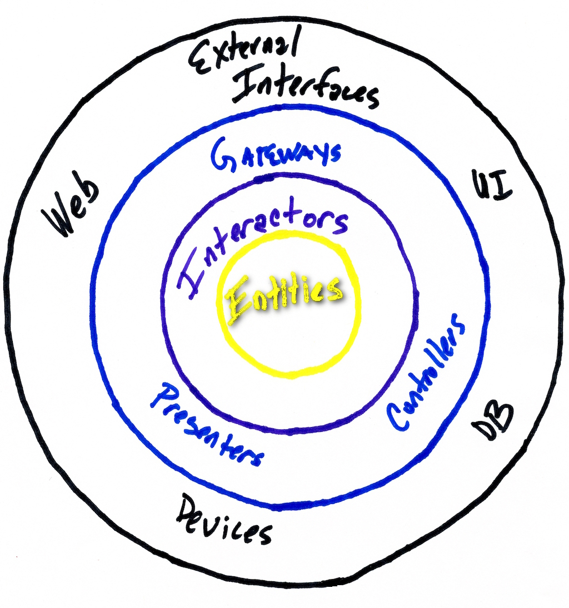

[Clean architecture](https://blog.8thlight.com/uncle-bob/2012/08/13/the-clean-architecture.html) has many names. It has been well defined by guru's in the industry since the 1980's.[^clean-names] 
Despite existing for so long with many names, it is exceedingly rare to find it in the wild.

{:height="512px"}

***So what is it and why would you want it?*** 

Let's say you want to build an app. (After all everyone is building apps these days.) 
Often the first discussion developers have about it include the following questions:

* What framework should we use?
* What database should we use?
* Is it an android or iphone app or both?

Clean architecture allows you to defer the answer to all these questions.
But wait, how do I write this app without knowing the answers to any of these questions?
The answer is that you focus on what the 'app' does. You focus on the domain. You identify
the entities that make up the domain. The you focus on the interactions (use cases) for the domain. 
Now you can use any framework you want to deliver your 'app'. 
Now you can use any database/storage you want to deliver your 'app'.
Now you can deliver your 'app' to any platform, including ones that you haven't even heard of yet.

That all sounds good but I want a really killer user interface on my 'app'.
No problem, invest in a killer user interface. It's'important. What is killer today
is passé tomorrow. When time comes to delivering the next killer user interface you are poised
to beat all your competitors to market. Because you now have the 
killer 'app' underneath your killer user interface.

Do you already have an 'app' already that is not based on clean architecture. 
How can you get to clean architecture? The answer is the same.
You identify the entities that make up the domain. Then you extract the interactions (business logic or use cases) that acts on 
the entities. You can do this as dedicated iterations/sprints or you can do it step by step through refactoring.

Are you ready for clean architecture? [Contact us]({{ "/contact-us" }}) we can help. 

[^clean-names]: 
    Other names for Clean Architecture include: [Hexagonal Architecture](http://alistair.cockburn.us/Hexagonal+architecture),
    [Onion Architecture](http://jeffreypalermo.com/blog/the-onion-architecture-part-1/), 
    [Domain Context Interaction (DCI)](http://www.amazon.com/Lean-Architecture-Agile-Software-Development/dp/0470684208/) 
    and [Boundary Control Entity (BCE)](http://www.amazon.com/Object-Oriented-Software-Engineering-Approach/dp/0201544350).

